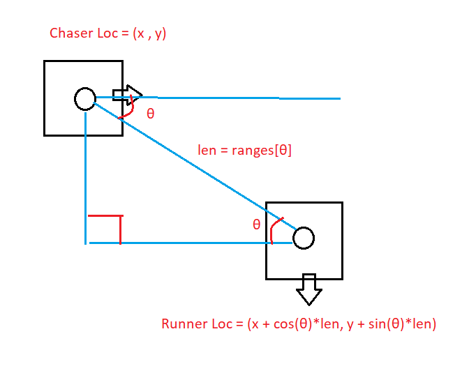

# Turtlebot Tag

## Project Description

_Describe the goal of your project, why it's interesting, what you were able to make your robot do, and what the main components of your project are and how they fit together - please include diagrams and gifs when appropriate_

Our project consists of two robots (a chaser and a runner) playing tag. The runner moves in random directions and maintains that direction for a period of time. The chaser uses a path prediction algorithm to estimate where the runner will be, and catch it at that future location. The chaser achieves this by storing a history of the runner's locations, and uses statistical extrapolation algorithms to predict the path that the runner may be taking. Then, the chaser uses proportional control to move towards the predicted coordinate of the runner. Once the chaser tags the runner with its bumper sensor, the chaser will stop.

Our project is interesting because it is able to solve problems that the person follower code you can't solve. Specifically, our project can use path prediction model to predict the future path of the runner much more accurately and can let the chaser tag the runner even when the chaser is operating at a lower speed than the runner.

## System Architecture

_Describe in detail the robotics algorithm you implemented and each major component of your project, highlight what pieces of code contribute to these main components_

### Runner Detection

We implement our object tracking algorithm in `detect_runner.py`. The way we design the runner is to put 11 different AR tags on its sides. When the runner shows up in chaser's camera field of view, we check for an average location of the runner's AR tags so that we can locate where the runner is in the chaser's camera. From the average location of the runner's AR tags, we can estimate where the runner is to the chaser and find the estimated distance and angle from the chaser to the runner.

Finally, the estimated distance and angle to the runner robot are published to the topic `angle_vectors`, to be used by `prediction.py` in the path prediction process.

### Path Prediction

All of the features of path prediction are handled in `prediction.py`.

Our prediction algorithm involves collecting a history of positions of the runner robot as x and y coordinates, and then using those coordinates and basic statistical modelling approaches to extrapolate a possible path for the robot. In order to collect x & y positions of the runner, we must also track the current x & y position of our chaser robot. We do this by setting its starting location to be the origin, (0,0), and as the chaser moves, we use odometry data to update its stored x and y coordinates of the robot, keeping constant track of its location. This is handled in the callback function to laser scan updates, `scan_callback`. We then use this information, combined with the angle and distance sent by the ardetect.py module, to calculate a coordinate for the runner robot. 

The following diagram shows how we're calculating these coordinates from the given information. 

Once we calculate a coordiante position for the runner, we add it, with a timestamp, to our runner location history array. This array is published to RVIZ as a series of poses so that we can debug the process (see the gif on the right hand side). Once we have our array of coordinates for the robot, we perform a linear regression on the most recent < 20 points to predict a line of best fit corresponding with the path of the runner robot.

### Movement

TODO

### Runner Behavior

TODO

### Bumping

TODO

## Execution

_Describe how to run your code, e.g., step-by-step instructions on what commands to run in each terminal window to execute your project code._

**Launching the Chaser**:

1. `roscore`
2. SSH into a robot with `ssh pi@192.168.0.???`, then run `set_ip ???` and `bringup`
3. SSH into robot again, this time running `set_ip ???` and `bringup_cam`
4. `rosrun image_transport republish compressed in:=raspicam_node/image raw out:=camera/rgb/image_raw`
5. Finally, run `roslaunch tag_final_project prediction.launch` This launch file will launch the ardetect.py and prediction.py nodes

**Launching the Runner**:
1. `roscore`
2. SSH into a robot with `ssh pi@192.168.0.???`, then run `set_ip ???` and `bringup`
3. `rosrun tag_final_project runner.py`

## Challenges, Future Work, and Takeaways

_These should take a similar form and structure to how you approached these in the previous projects (1 paragraph each for the challenges and future work and a few bullet points for takeaways)_

### Challenges
When we implement our project, we encounter the following challenges: 
- Due to the lag of the camera, the AR tags on the runner are sometimes not visible to the chaser robot. This will cause us to record some missing travel history points of the runner, which will in turn cause us to be unable to make prediction on the runner's path. Whenever this happens, we will need to move close to csil5 and hope that the router's connection is strong and stable.
- Since the chaser's LiDAR range is only 3 meters, we can't really predict the location of the runner if the runner moves outside of chaser’s LiDAR. Thus, to let our model works, we need to ensure that the runner is within the LiDAR range of the chaser.
- Because we are only able to add a bumper sensor at the front of the chaser, it sometimes would encounter difficulty ensure the chaser's front side to hit the runner. Yet, by adding extra card board layes in front of the touch sensor, we are able to expand the surface area of the touch sensor and incrase the successful tag rate. 

### Future Work

### Takeaways

### Limitations of our Approach
For the sake of time, we had to make a few concessions to simplify our project, but there are many interesting extensions here that we would've liked to pursue.

- Detecting runner direction - Our current approach to predicting the runner's trajectory involves guessing their direction by extrapolating from the history of their past locations, but our approach does not attempt to estimate or use information about the current orientation of the runner. We had discussed a method for doing this that would involve a few smaller AR tags, one on each side of the runner, as well as prediction algorithms that would take advantage of this data, but it quickly grew to beyond the scope of what we could tackle within the timeline.

TODO
